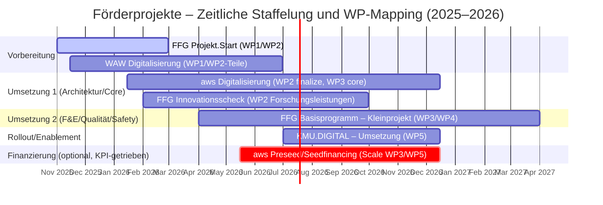

# Einreichkalender (Gantt) – Förderprojekte 2025–2026

Hinweise
- Abgrenzung Kostenstellen: Keine Doppelförderung derselben Kosten/Leistungen.
- Sequenzierung: FFG Projekt.Start + WAW parallel; danach aws Digitalisierung → FFG Basisprogramm; KMU.DIGITAL implementierungsnah.
- Optionalität: aws Preseed/Seedfinancing nur bei passenden KPIs/Co‑Investoren.
- Artefakte: Jede Tranche zielt auf >12 Monate Runway (gesamt 18–24M), Meilensteine WP‑gebunden.
